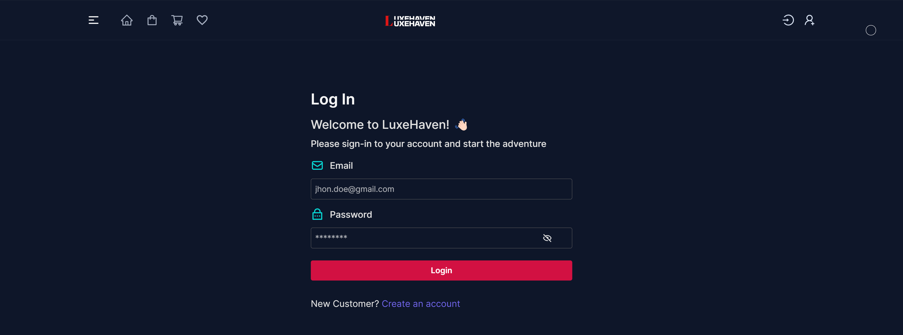
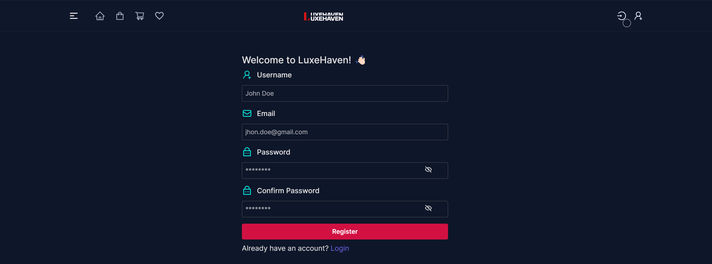
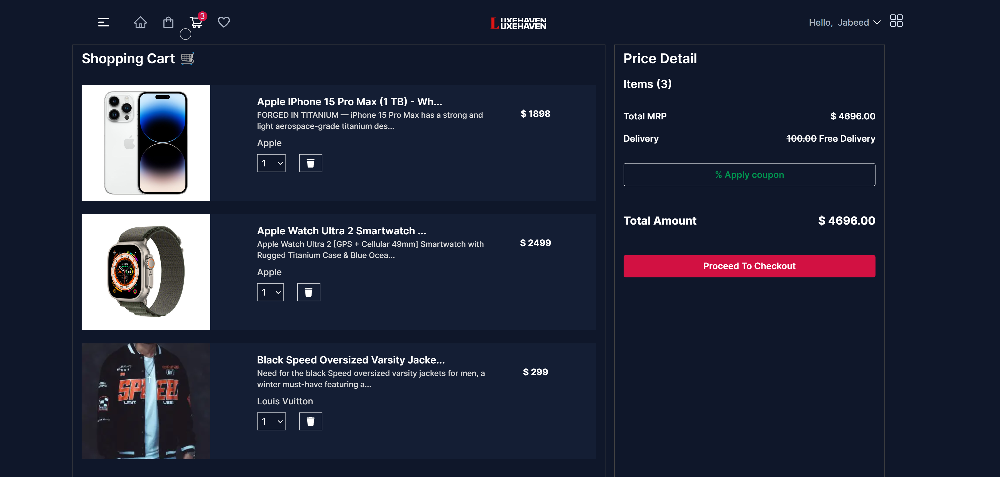
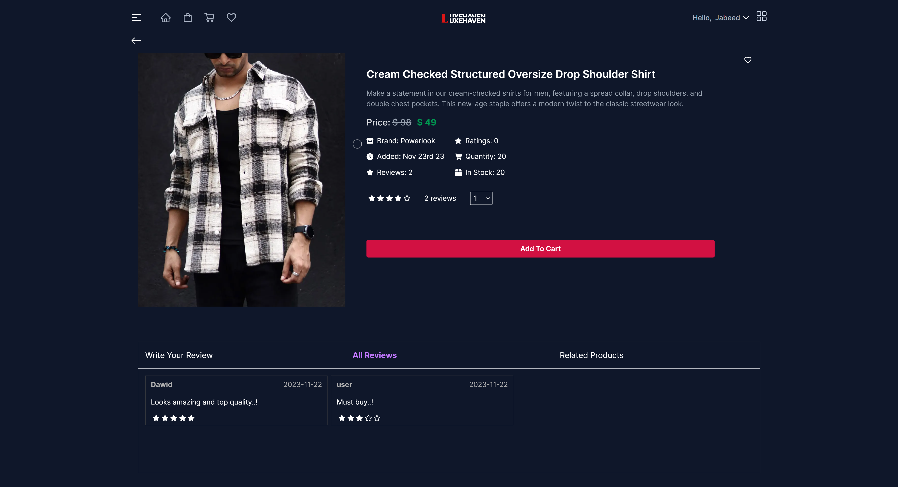
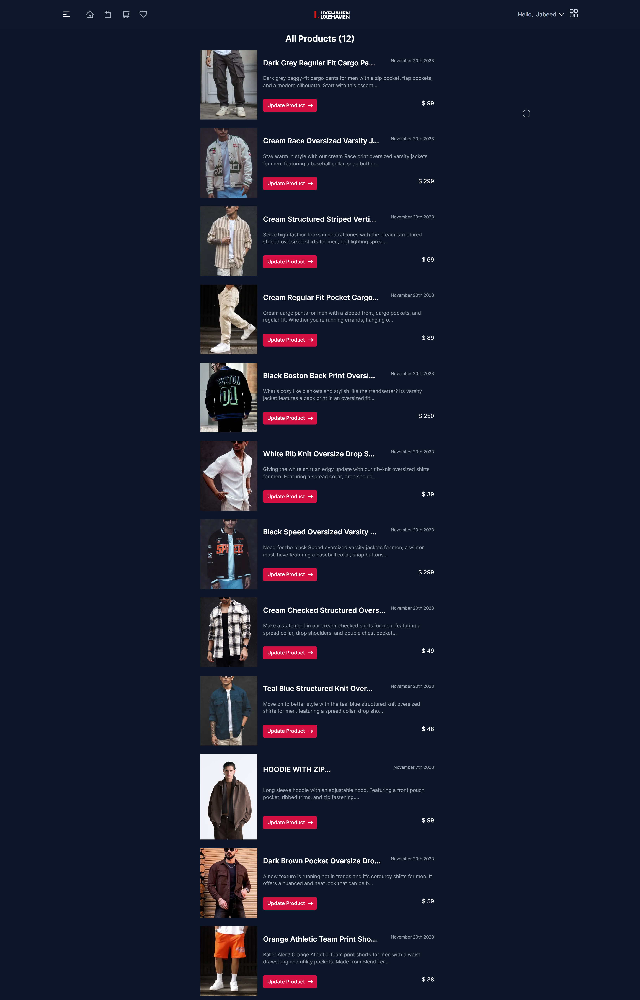
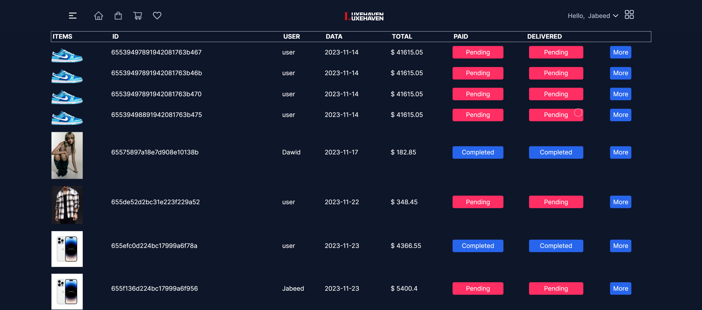

# LuxeHaven - A Modern Fullstack (MERN) E-Commerce Platform

- LinkedIn: [iamjabeed](https://www.linkedin.com/in/iamjabeed/)

- Instagram: [iamjabeed_04](https://www.instagram.com/iamjabeed_04/)

#### Project Result Screenshots:

_Home Page_

_Shop Page_

_Login Page_

_Register Page_

_Cart🛒_

_Product Detailed Page_

- Scroll down for Admin related pages

## Requirement Document

## Table of Contents

1. [Introduction](#1-introduction)
2. [User Features](#2-user-features)
3. [Requirements](#3-requirements)
4. [Admin Features](#4-admin-features)
5. [Tech Stacks](#5-tech-stacks)
6. [Conclusion](#6-conclusion)

## 1. Introduction

This requirement document outlines the features and tech stacks for the development of a top-notch MERN (MongoDB, Express, React, Node.js) E-Commerce website. The goal is to provide a seamless shopping experience for users and empower administrators with efficient management tools. The website will boast a stunning user interface, exceptional user experience, and a feature-rich admin dashboard.

## 2. User Features

### 2.1 User Authentication and Account Management

- User registration with email.
- User registration with social media options(v2).
- Secure login using email and password.
- Logout functionality for user account security.

### 2.2 User Profile Management

- Users can edit their profiles, including name, email, profile picture(v2), and contact information(v2).
- Ability for users to change their login password.
- Detailed order history for users to track and re-order items.
- Wishlist feature for users to create, edit, and manage a list of desired products.

### 2.3 Shopping Features

- A dynamic and well-organized product catalog with advanced filtering and sorting options.
- Product details pages with high-resolution images, comprehensive descriptions, user reviews, and related product suggestions.
- User-friendly shopping cart with the capability to add, remove, and modify items.
- Streamlined and secure checkout process with multiple payment options.
- Integration with PayPal for seamless and secure transactions.
- Automated order confirmation emails and SMS notifications with tracking details(v2).
- The ability for users to leave detailed reviews and ratings for products.
- Product comparison functionality to assist users in making informed purchase decisions(v2).

### 2.4 Search and Navigation

- A powerful search engine to quickly find products.
- Advanced filtering and sorting options based on categories, prices, brands, and customer ratings.
- Featured and best-selling product showcase.
- "Recently Viewed Items" feature to allow users to revisit previously viewed products(v2).

### 2.5 Customer Support and Communication(v2)

- Real-time live chat support for user inquiries and assistance.
- Automated email notifications for order updates, promotions, and personalized recommendations.
- A comprehensive help center with FAQs, tutorials, and troubleshooting guides.
- User-friendly returns and refunds process.

### 2.6 User Engagement(v2)

- Newsletters and subscription options for users to receive updates and promotions.
- Utilization of AI-driven recommendations to suggest products tailored to individual user preferences.
- User reviews and ratings feature for contributions to product and seller reviews.
- Social sharing capability to enable users to share product links on social media platforms.

## 3. Requirements

To achieve our vision of creating a top-notch E-Commerce website, we have the following key requirements:

### 3.1 Functional Requirements

- **User Registration and Authentication**:

  - User registration with email and social media accounts.
  - Secure user login and logout.
  - User password management and password reset.

- **User Profile Management**:

  - Edit user profiles.
  - Track and re-order items from order history.
  - Wishlist management.

- **Shopping Features**:

  - Dynamic product catalog.
  - Product details with images, descriptions, and reviews.
  - Shopping cart and checkout process.
  - Integration with PayPal for payments.
  - Order confirmation and tracking.

- **Search and Navigation**:

  - Powerful search engine.
  - Advanced filtering and sorting.
  - Featured and best-selling products.
  - Recently viewed items.

- **Customer Support and Communication(v2)**:

  - Real-time chat support.
  - Automated email notifications.
  - Comprehensive help center.
  - Returns and refunds.

- **User Engagement**:

  - Newsletters and subscriptions(v2).
  - AI-driven product recommendations(v2).
  - User reviews and ratings.
  - Social sharing(v2).

- **Security and Privacy**:
  - Secure payment processing.
  - Data privacy and compliance.

### 3.2 Admin Dashboard Requirements

- Secure admin login and logout.
- Real-time sales, revenue, and user activity data on the admin dashboard.
- Product and category management.
- Order and customer management.
- Analytics and reporting for sales, inventory, and user insights.

## 4. Tech Stacks

### Frontend (Package Information)

- **React**: Frontend built with React for responsive and dynamic user interfaces.
- **React Router**: For managing routes and navigation.
- **Redux Toolkit**: State management and optimization.
- **RTK Query**: For making API requests to the backend.
- **PayPal Integration**: Handling secure payments.
- **ApexCharts**: Creating stunning charts and analytics.
- **TailwindCSS**: Styling and layout.

### Backend (Package Information)

- **Node.js and Express**: Building the backend server.
- **MongoDB**: Database for product, user, and order data.
- **Mongoose**: ODM for MongoDB interactions.
- **JWT (JSON Web Tokens)**: User authentication.
- **Multer**: Handling file uploads.
- **Express-Async-Handler**: Simplifying error handling in async routes.
- **Cookie Parser and CORS**: Managing cookies and handling cross-origin requests.

## 5. Conclusion

This requirement document sets the bar for a top-notch MERN E-Commerce website. It aims to provide users with an outstanding shopping experience while empowering administrators with robust tools for efficient management. By incorporating modern technologies and an array of features, the website is poised to stand out in the competitive E-Commerce landscape.

##### Admin Pages

_All products_

_All Orders_

